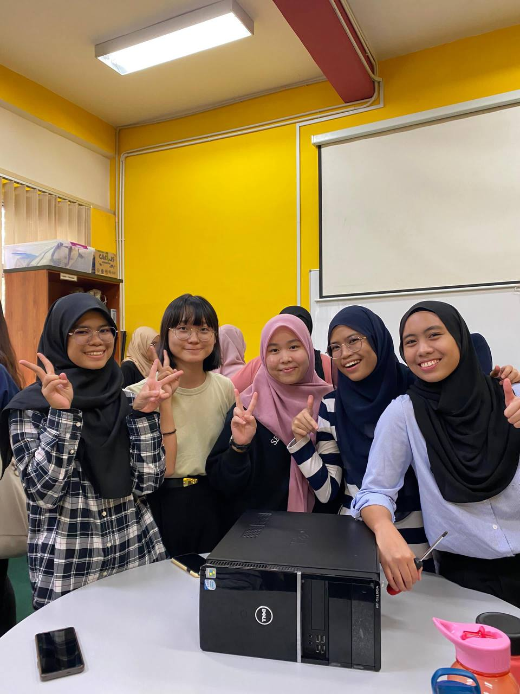
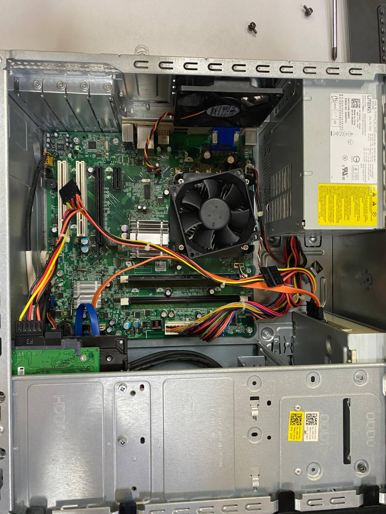
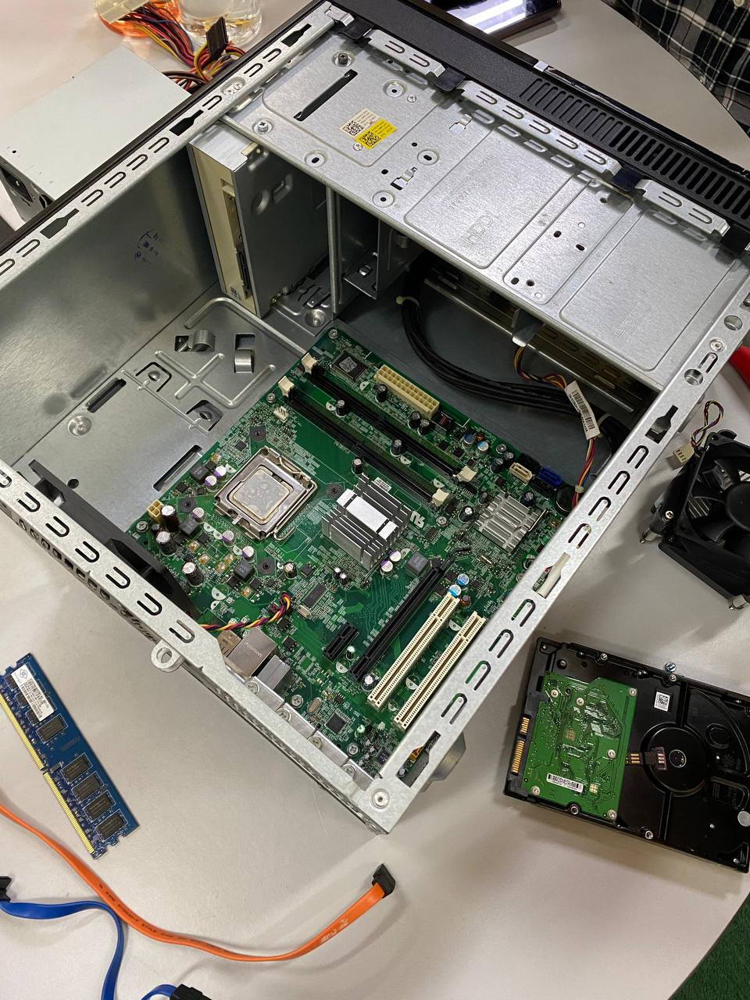

# Reflection on PC Assembly and Disassembly 🖥️

The journey of assembling and disassembling a PC has been a hands-on exploration, delving into the intricacies of computer technology. Assembling the PC demanded precision and attention to detail, akin to solving a complex puzzle where each component played a crucial role. 🧩 
Patience and meticulousness were key during this process. 

Disassembling the PC provided insights into the interconnected nature of components, emphasizing the modular and upgradeable aspects of PCs. Despite facing challenges in cable management and component compatibility, the experience enriched my technical knowledge and problem-solving skills. 🛠️ The collaborative effort involved in the assembly process also fostered teamwork. Overall, this practical journey has equipped me with valuable skills and confidence for future engagements in the dynamic field of technology. 👩‍💻🚀

# Improvement
I recognize that improving my precision and attention to detail during the assembly process is crucial. Another area for improvement is effective team communication, as clearer communication leads to more efficient collaboration.

  <h3>-Group Photo-</h3>
  
  
   

  <h3>-Before Disassembly-</h3>
  

  <h3>-After Disassembly-</h3>
  

